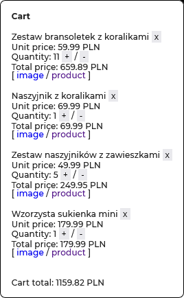

# synerise-recruitment-09-2025

This is a script which focuses on product cart functionality. It uses `localStorage` as its source of truth. It was made specifically for the [Reserved Online Store](https://www.reserved.com/pl/pl/). It works only on product pages ([example](https://www.reserved.com/pl/pl/koszula-regular-z-dodatkiem-lnu-427gt-05p)) and it was not tested on, for example, the main page.

## Usage

1. Enter [Reserved Online Store](https://www.reserved.com/pl/pl/).
2. Proceed to any product page ([example](https://www.reserved.com/pl/pl/koszula-regular-z-dodatkiem-lnu-427gt-05p)).
3. Open the browser's toolbox (`Ctrl+Alt+Shift+I` on Windows/Linux or `Cmd+Opt+Shift+I` on Mac).
4. Proceed to the "console" tab.
5. Paste the contents of [index.js](index.js) into the console.
6. Observe as the product card renders.



## Features

1. Parsing product data from the page.
2. Adding products by running the script.
3. Removing products by clicking the "x" button or decreasing quantity to 0.
4. Quantity adjustment by clicking "+" and "-" buttons.
5. Data persists between pages, as the script uses `localStorage`.
6. Total cart and total product price calculation.

## Technical documentation

This script involves 13 functions.

### `localStorage` operations

#### `getCart()`

The function accesses the `cart` item from `localStorage` and parses the included JSON into an object.

```javascript
function getCart() {
  let cart = JSON.parse(window.localStorage.getItem("cart")) ?? []
  return cart
}
```

#### `setCart(cart)`

The function turns the cart parameter into a JSON string and then sets its contents in `localStorage` under the `cart` key.

```javascript
function setCart(cart) {
  window.localStorage.setItem("cart", JSON.stringify(cart))
}
```

#### `clearCart()`

The function turns an empty array into a JSON string and then sets its contents in `localStorage` under the `cart` key, clearing its contents.

```javascript
function clearCart() {
  window.localStorage.setItem("cart", JSON.stringify([]))
}
```

### `cart` operations

#### `addProduct(product)`

The function accesses the cart, searches for the newly added product in the cart and then adds it or increases its quantity. Then it saves the changes in `localStorage` and re-renders the cart.

```javascript
function addProduct(product) {
  let cart = getCart()
  let productIndex = getProductIndex(product, cart)
  if (productIndex == -1) {
    cart.push({ ...product, quantity: 1 })
  } else {
    cart[productIndex].quantity++
  }
  setCart(cart)
  renderCart()
  return cart
}
```

#### `removeProduct(productIndex)`

The function removes the product from the cart using its index in the array. Saves the data into `localStorage` and re-renders the cart.

```javascript
function removeProduct(productIndex) {
  let cart = getCart()
  cart.splice(productIndex, 1)
  setCart(cart)
  renderCart()
  return cart
}
```

#### `increaseQuantity(productIndex)`

The function uses its `productIndex` parameter to increase the specific product's quantity. Saves to `localStorage` and re-renders the cart.

```javascript
function increaseQuantity(productIndex) {
  let cart = getCart()
  if (cart[productIndex]) {
    cart[productIndex].quantity++
    setCart(cart)
    renderCart()
  }
  return cart
}
```

#### `decreaseQuantity(productIndex)`

The function uses `productIndex` to decrease product's quantity. If quantity reaches 0, it removes the product from cart. Saves to `localStorage` and re-renders the cart.

```javascript
function decreaseQuantity(productIndex) {
  let cart = getCart()
  if (cart[productIndex]) {
    if (cart[productIndex].quantity > 1) {
      cart[productIndex].quantity--
      setCart(cart)
      renderCart()
    } else {
      removeProduct(productIndex)
    }
  }
  return cart
}
```

### Helper functions

#### `calculateProductTotal(quantity, price)`

Simple function which calculates the total price for a specific product type.

```javascript
function calculateProductTotal(quantity, price) {
  return quantity * price
}
```

Could be rewritten as:

```javascript
const calculateProductTotal = (quantity, price) => quantity * price
```

#### `parsePrice(price)`

Since the `price` parsed from the product page is a string that looks, for example, like this `"199,99 PLN"`, we need to be able to parse the numerical part of the price, and getting the currency from it is useful, too. We also replace "," with ".", since programming languages do not see "," as a symbol separating numbers from their decimals. The function also looks out for non-breaking spaces, which the Reserved store uses for displaying prices.

```javascript
function parsePrice(price) {
  let parts = price.split(" ")
  if (parts.length === 1) {
    parts = price.split("\u00A0") // non-breaking space
  }
  let numeric = parseFloat(parts[0].replace(",", "."))
  let currency = parts[1]
  return { numeric, currency }
}
```

### Product data

#### `getProductData()`

The function extracts product data from the page and returns it as an object.

```javascript
function getProductData() {
  // according to best SEO practices, product name should be the only h1 element
  let name = document.getElementsByTagName("h1")[0].innerText
  // get the rest of the product data by using class names
  let price = document.getElementsByClassName("basic-price")[0].innerText
  let image = document.getElementsByClassName("sc-hzMMVR")[0].src
  let url = window.location.href
  return { name, price, image, url }
}
```

#### `getProductIndex(product, cart)`

The function returns the index of a product in the cart array. It is found by using the product's url, since that should be the only unique value for each product. It is a separate function because it's useful for searching the cart and we can not search for it outright because we do not know the current quantity of the product.

```javascript
function getProductIndex(product, cart) {
  // find product via url, we don't know the quantity
  let object = cart.find((obj) => obj.url == product.url)
  return cart.indexOf(object)
}
```

### Rendering

#### `renderProduct(product, index)`

Renders product data in the cart.

```javascript
function renderProduct(product, index) {
  let productPrice = parsePrice(product.price)
  let productTotal = calculateProductTotal(
    product.quantity,
    productPrice.numeric
  )
  let productDiv = document.createElement("div")
  productDiv.innerHTML += `
      <p>
        ${product.name} 
        <button onClick="removeProduct(${index})">x</button>
      </p>
      <p>Unit price: ${productPrice.numeric} ${productPrice.currency}</p>
      <p>
        Quantity: ${product.quantity}
        <button onClick="increaseQuantity(${index})"}>+</button> / <button onClick="decreaseQuantity(${index})"}>-</button>
      </p>
      <p>Total price: ${productTotal.toFixed(2)} ${productPrice.currency}</p>
      <p>[ <a href=${product.image}>image</a> / <a href=${
    product.url
  }>product</a> ]</p>
    `
  productDiv.style.cssText = `
        margin-top: 1rem;
      `
  return productDiv
}
```

#### `renderCart()`

Renders the entire cart.

```javascript
function renderCart() {
  let cartDiv = document.getElementById("cart")
  let productsDiv
  if (!cartDiv) {
    cartDiv = document.createElement("div")
    cartDiv.id = "cart"
    cartDiv.style.cssText = `
      background-color: white;
      position: fixed;
      right: 0;
      bottom: 0;
      z-index: 1000000;
      padding: 1rem;
      margin: 1rem;
      border: 1px solid black;
      border-radius: 8px;
      max-height: 90vh;
      overflow: auto;
    `
    let title = document.createElement("h2")
    title.innerText = "Cart"
    title.style.fontWeight = "bold"
    cartDiv.append(title)
    productsDiv = document.createElement("div")
    productsDiv.id = "products"
    cartDiv.append(productsDiv)
  } else {
    productsDiv = document.getElementById("products")
    if (productsDiv) productsDiv.innerHTML = ""
  }

  let cart = getCart()

  let cartTotal = 0
  let { currency } = cart[0] ? parsePrice(cart[0].price) : ""
  for (let i = 0; i < cart.length; i++) {
    let productDiv = renderProduct(cart[i], i)
    productsDiv.append(productDiv)
    let quantity = cart[i].quantity
    let { numeric } = parsePrice(cart[i].price)
    cartTotal += calculateProductTotal(quantity, numeric)
  }

  let cartTotalDiv = document.getElementById("cart-total")
  if (!cartTotalDiv) {
    cartTotalDiv = document.createElement("p")
    cartTotalDiv.id = "cart-total"
    cartDiv.append(cartTotalDiv)
  }
  cartTotalDiv.innerText = `Cart total: ${cartTotal.toFixed(2)} ${
    currency ?? ""
  }`
  cartTotalDiv.style.marginTop = "2rem"
  document.body.append(cartDiv)
}
```

## Potential improvements and edge cases

The script could be improved in many ways.

1. Styling is too simple.
2. Adding a button that hides the cart could be a good idea, since it can hide too much of the page.
3. The script could potentially be used on a different locale of the store, using a different currency but the total would still be calculated according to the numeric values, not differentiating between, say, EUR or PLN.
4. At first I tried displaying icons for the products but there are CORS problems.
